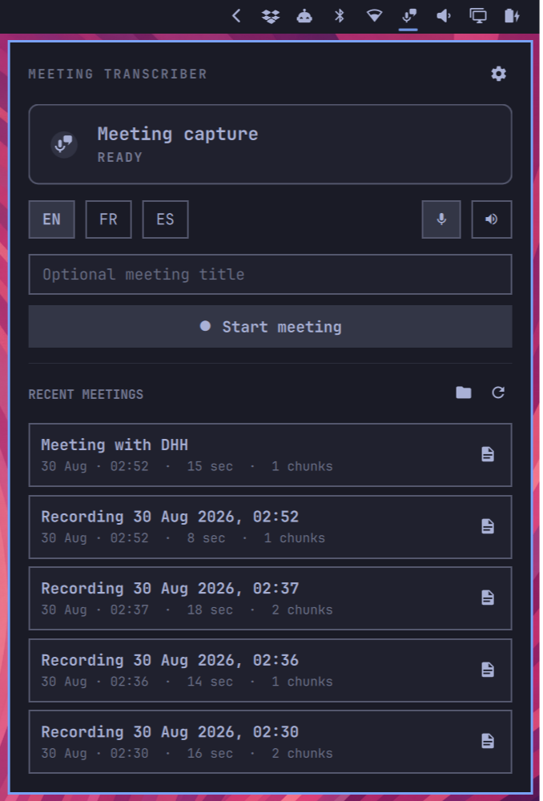

# Voxtype Meeting Transcriber

An Omarchy Quattro bar widget for local meeting transcription. It preserves utterance timestamps and conversation order while using the local engine already configured in Voxtype.



## Requirements

- Omarchy 4 with the Quattro shell plugin system
- [Voxtype](https://github.com/peteonrails/voxtype) with a supported local engine configured
- PipeWire or PulseAudio compatibility tools
- Python 3.11 or newer (plugin helper)
- Rust toolchain (`cargo`), only when building the capture service

No sudo or pkexec is required. The plugin does not install packages, rewrite Omarchy system files, or start a second Quickshell process.

## Installation

Install the bar widget from the public GitHub repository with the official Omarchy command:

```bash
omarchy plugin add https://github.com/boomdev/voxtype-meeting-transcriber.git --enable
```

Omarchy displays its unsandboxed-plugin warning and asks for confirmation before cloning. For a bar widget, it also lets you confirm placement; the manifest defaults to the right section.

If the plugin was added without `--enable`, activate it explicitly:

```bash
omarchy plugin enable io.github.boomdev.voxtype-meeting-transcriber --section right
```

`omarchy plugin add` only clones and enables the plugin. It does not run install hooks. Open the panel and use **Install capture service**, or build the per-user capture service from the cloned plugin directory:

```bash
~/.config/omarchy/plugins/io.github.boomdev.voxtype-meeting-transcriber/scripts/install-user.sh
```

That script compiles this repository's `service/` crate with Cargo, installs `voxtype-meeting-service` to `~/.local/bin`, and enables the user systemd unit `voxtype-meeting-service.service`. Disable Voxtype's native meeting mode; this plugin uses `~/.config/voxtype/config.toml` only as the transcription engine configuration.

## Usage

- Left click opens or closes the meeting panel. Escape or clicking outside closes it.
- Right click refreshes service state.
- Start, stop, pause, and resume provide immediate pending feedback.
- The gear configures capture source/devices, audio retention, and which languages appear on the meeting page; engine and model are read-only (those are configured in Voxtype).
- Recent meetings offer **Export and Open**, then **Open** after a transcript has been exported.
- `S` starts or stops while the main view has focus; `R` refreshes.

To disable the widget without removing its files:

```bash
omarchy plugin disable io.github.boomdev.voxtype-meeting-transcriber
```

## Configure

```bash
omarchy bar move io.github.boomdev.voxtype-meeting-transcriber --section right
```

Language chips in the panel write the selected language back to `~/.config/voxtype/config.toml` only when you click them. They do not change Voxtype configuration on install or at idle.

Meeting data is stored under the XDG data directory for `voxtype-meeting-service` (`~/.local/share/voxtype-meeting-service` by default). Transcripts export to `~/Documents/Meetings` unless you change the folder in settings. See [the complete feature specification](docs/features.md).

## Updating and removing

Update the Git-managed plugin with:

```bash
omarchy plugin update io.github.boomdev.voxtype-meeting-transcriber
```

After a plugin update, rebuild the capture service from the same plugin directory if the service crate changed:

```bash
~/.config/omarchy/plugins/io.github.boomdev.voxtype-meeting-transcriber/scripts/install-user.sh
```

Remove the capture service **before** removing the plugin, so the uninstall script is still on disk:

```bash
~/.config/omarchy/plugins/io.github.boomdev.voxtype-meeting-transcriber/scripts/uninstall-user.sh
omarchy plugin remove io.github.boomdev.voxtype-meeting-transcriber
```

If the plugin directory is already gone, stop the service by hand:

```bash
systemctl --user disable --now voxtype-meeting-service.service
rm -f ~/.config/systemd/user/voxtype-meeting-service.service ~/.local/bin/voxtype-meeting-service
systemctl --user daemon-reload
```

Removal does not delete meeting transcripts, exported Markdown, or Voxtype configuration.

## Troubleshooting

- **The widget is not on the bar:** `omarchy plugin enable io.github.boomdev.voxtype-meeting-transcriber --section right`
- **The panel says the capture service is missing:** use **Install capture service** in the panel, or run `scripts/install-user.sh` from the cloned plugin directory. Rust's `cargo` is required for that build.
- **The service is installed but unavailable:** `systemctl --user start voxtype-meeting-service.service`, or use **Start capture service** in the panel.
- **Language chips do nothing useful:** configure a local Voxtype engine in `~/.config/voxtype/config.toml`. Remote Voxtype engines are rejected for meeting capture.
- **Changes do not appear after an update:** `omarchy restart shell`

## Privacy and permissions

The plugin and capture service run as your user, unsandboxed, inside Omarchy's shell process and a user systemd unit. No sudo or pkexec is required.

The helper talks to `voxtype-meeting-service` over a Unix socket under `$XDG_RUNTIME_DIR`. It reads Voxtype's config to show the engine, model, and languages, and it rewrites the language field in that file only after an explicit language-chip click.

Transcription is local only. The capture service runs Voxtype or whisper.cpp on this machine and never uploads captured audio. Capture audio, transcripts, and the service database stay on the local machine.

## Development and validation

```bash
omarchy plugin validate .
qmllint -I "$OMARCHY_PATH/shell" BarWidget.qml Panel.qml Backend.qml CappedProcess.qml IconButton.qml
```

## License

Copyright © 2026 boomdev. Released under the [MIT License](LICENSE).
